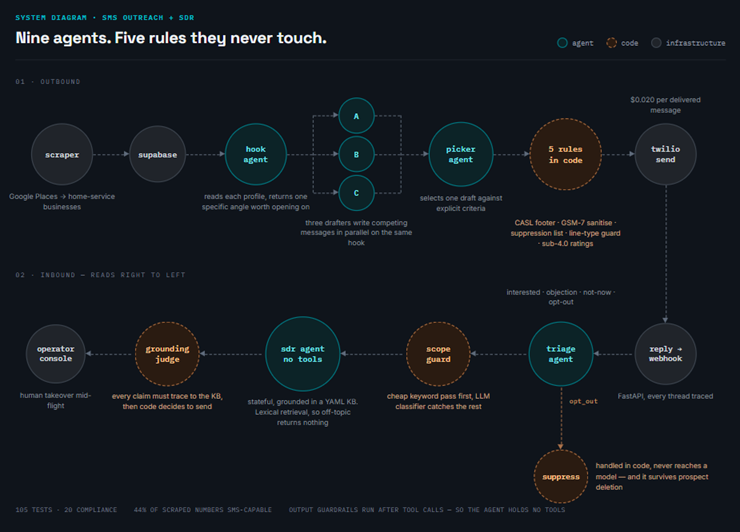
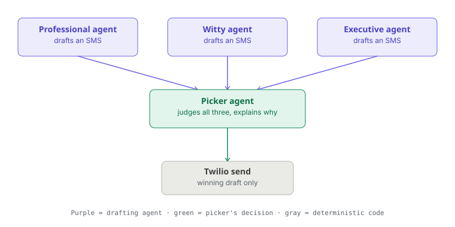
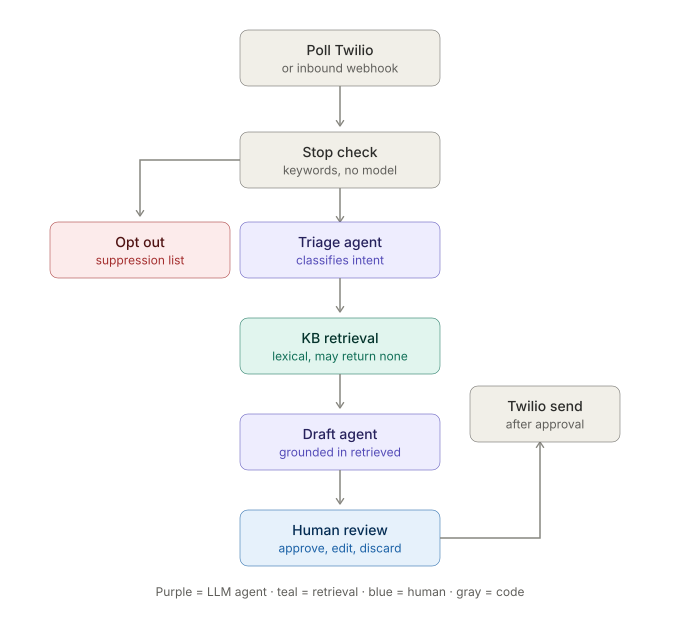
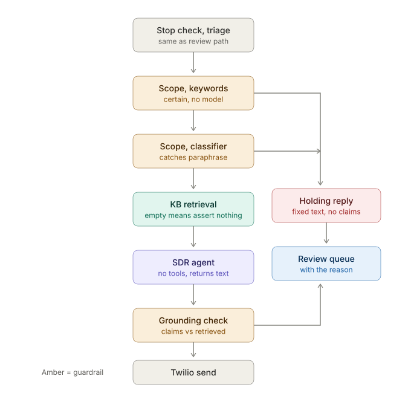

# VoiceCaptures SMS Outreach Agent

Agentic SMS sales outreach for VoiceCaptures, built on the OpenAI Agents SDK
and Twilio. Sends bulk cold outreach via a deterministic multi-agent
drafting/picker pipeline, then hands live conversations to a stateful
conversational SDR agent that responds to inbound replies in real time.



## What this cost and what it found

Cold SMS outreach to home service businesses in BC. 37 leads scraped from
Google Maps, 18 messaged, everything below measured rather than estimated.

**The headline number is deliverability, and it was not the one I set out
to measure.**

| | |
|---|---|
| Leads scraped and filtered | 37 |
| Messages sent | 18 |
| **Delivered** | **8 (44%)** |
| Failed as landline or unreachable | 10 (56%) |
| Replies | 0 so far (sent within hours; too early to read) |
| Cost per message, OpenAI | $0.0004 |
| Cost per message, Twilio | $0.0083 (1 segment) |
| **Cost per *delivered* message** | **$0.020** |

**Roughly half of business phone numbers on Google Maps cannot receive
SMS.** They are office landlines. This is obvious in hindsight and was
invisible for three days of development, because every end-to-end test
went to my own mobile.

It changes the economics rather than killing them: cost per reachable
prospect is a little over double cost per send, and any reply rate has to
be quoted against 44%, not 100%. A channel worth running, with a
qualifier that has to travel with every number.

Twilio's Lookup product answers this directly, but **Line Type
Intelligence requires NPAC approval for Canadian numbers** and returns
error 60601 without it. The workaround costs nothing: Twilio already
reports the line type after the fact, in error 30006 on a failed send.
`app/check_delivery.py` reads those statuses back and records them, and
`send_sms` refuses known landlines from then on. The limitation is real -
it only protects the second message onward, because the first send is the
evidence.

**What is not measured, and why.** Reply rate, cost per booked
appointment, and persona performance all need volume that 18 sends does
not provide. At an 8% reply rate, 8 delivered messages predict 0 to 1
replies - so zero tells you nothing. Those numbers are absent rather than
estimated.

**What the build cost:** three days, $0.35 of OpenAI, about $0.15 of
Twilio, $0.30 of Google Places.

## Commands

```bash
# Run the app
uvicorn app.main:app --reload --port 8000     # console at /admin

# Tests
python -m pytest                              # all of them, ~4s, no API key
python -m pytest tests/test_compliance.py     # just the must-not-fail rules
python -m pytest -k phone                     # one topic

# Leads
python -m app.scrape_places --area vancouver --type plumber --pages 3 --out data/van.csv
python -m app.scrape_places --area vancouver --type plumber --no-filter --out data/raw.csv
python -m app.db.import_csv data/van.csv      # appends and updates; never wipes

# Measure without sending
python -m app.measure_cold --where BC --limit 40 --out runs/bc.csv

# Cold outreach from the CLI
python -m app.run_cold_batch --limit 3        # dry run by default
python -m app.run_cold_batch --limit 3 --live # SENDS. no review step.

# Inbound when there is no public webhook
python -m app.poll_inbound
python -m app.review_pending                  # CLI equivalent of /admin/review
```

**`--live` sends real SMS with no review.** It has no location filter, so
it takes whatever is at `status='new'`. For anything other than a batch
you have already spot-checked, use `/admin` and approve messages one at a
time.

`GOOGLE_MAPS_API_KEY` is read from the environment, not `.env`, so
`scrape_places` needs it set in the shell.


## Agents

Six agents in three groups. Orchestration is in code, not delegated to an
LLM, and the send is a plain function call rather than a tool an agent can
decide to invoke.

**Cold outreach.** A hook agent picks the personalization angle, three
drafting agents write variants in parallel under different personas, and a
picker agent selects the winner. Fully autonomous: a weak generic first
message is low-risk at volume.

**Triage.** One cheap-model agent classifies every inbound reply as
`interested` / `not_interested` / `question` / `hot_lead` / `unclear` /
`opt_out`. Runs on everything that survives the hard-coded STOP check.

**Reply generation - two agents, same job, different trust level.**
`draft_reply_agent` returns text a human approves in `/admin/review`.
`sdr_agent` is the autopilot: opt-in per contact via `prospects.autopilot`,
off by default. Both ground their answers in the same knowledge base.

The autopilot agent has **no tools at all**. It returns structured output
and code decides what happens to it. Two reasons, both learned the hard
way:

- It used to hold `send_sms_tool`. Output guardrails run *after* tool
  calls, so a grounding check could only ever inspect a message Twilio had
  already delivered, and a text cannot be unsent.
- It used to hold `flag_human_handoff_tool`, which called
  `set_autopilot(False)` as a side effect - meaning the agent could
  silently disable autopilot on any message it chose, with nothing between
  the decision and the effect and no record that it happened. That is now
  an `escalate` / `handoff` field on the returned object, which code acts
  on and the trace records.

## Knowledge base

Everything the agents may assert lives in `app/kb/voicecaptures.yaml`.
Facts are not in the prompt: they are retrieved per message and the draft
is checked against what was retrieved.

**This is RAG with lexical retrieval, not dense retrieval.** No embeddings,
no vector store. The corpus is a couple of dozen facts about one product,
and the load-bearing property is that an off-topic question retrieves
NOTHING - that empty result is what tells the agent it may make no factual
claim. Cosine similarity always returns a nearest neighbour, so getting
the same behaviour would mean picking an arbitrary threshold. A linear
scan over ~11 entries costs nothing. Revisit past ~100 entries, or when
prospects phrase questions in words the triggers don't contain; that shows
up as escalations on questions the KB does cover, which is measurable.

## Guardrails

**Scope (input, two layers).** A literal keyword match runs first - free,
instant, and certain. Whether "how much does it cost" is a pricing
question must not depend on a sampled token. A cheap classifier then
catches paraphrases the keyword list can't enumerate ("what's the
damage?"). The classifier only ever *adds* refusals; it cannot overturn a
keyword block. Its instructions are generated from the same YAML, so the
two layers can't drift. Fails closed.

**Grounding (output).** A cheap model checks every factual claim in the
draft against the entries actually retrieved. Refusals, greetings and
questions are grounded by definition - they assert nothing.

**Holding replies.** A blocked message still gets an immediate
acknowledgement, verbatim from the KB. These are constants containing no
factual claim, which is why they are safe to send on a path where the
agent itself is not trusted to speak. Without them, a pricing question -
the highest-intent message in the funnel - was met with silence. Grounding
failures deliberately get no holding reply: the agent already spoke and
was caught, and a second automated message compounds it.

**What stops autopilot.** Only a genuine handoff: they asked for a person,
or they are ready to buy. A restricted topic or an uncovered question
refuses that one message and autopilot resumes on the next. Originally
every refusal disabled it, so the first pricing question turned autopilot
off permanently and everything after went to review with no indication
why - which looked exactly like autopilot being broken.

## Compliance

Opt-out handling is the one part of this system where a bug is a legal
problem rather than a product problem, so it is defended in three places.

1. **Hard-coded keyword check** runs before any agent sees the message.
   STOP and friends never reach an LLM.
2. **Triage classification** catches opt-outs phrased in words the keyword
   list doesn't cover.
3. **A `suppressions` table** records the number permanently. Append-only,
   keyed on the phone number, and deliberately without a foreign key to
   `prospects` - the obligation has to outlive the row that happened to
   carry it. Deleting a prospect, or re-importing a lead CSV, must not
   resurrect someone who opted out.

`send_sms` checks the suppression list before every send. That check lives
in the send function rather than at each call site so there is exactly one
place a message can leave the system, and it is guarded.

## Design note: no public demo surface

There is deliberately no public interactive demo. The system sends real
SMS to real prospects, and `/admin` shows real names and phone numbers,
so neither can be handed to an anonymous visitor. An earlier `/demo`
page existed and was removed: its conversational tool was simulated
rather than live, and it exposed an instant-real-send path gated on the
same shared secret as the admin console.

The public artifacts are instead the case study in this README, the eval
table, and a recorded end-to-end run. `/admin` is the password-protected
operator console over the real pipeline (poll -> triage -> draft -> human
review -> send) and doubles as the screen-recording surface. Session
login is signed with `SESSION_SECRET_KEY` - set it explicitly in
production or admin sessions won't survive a restart.
`app/poll_inbound.py` and `app/review_pending.py` remain as CLI
equivalents.

## Design note: minimal leads

Only `name` and `phone` are required anywhere in the pipeline - the CSV
importer and the hook agent both degrade
gracefully to a generic-but-relevant message when other fields (hours,
rating, review count) are missing. No special-casing needed; this was
built into the hook agent's instructions from the start.

## Design note: phone numbers are not unique

Prospects may share a phone number (migration 006). This exists so any
client can be pointed at the operator's own number for end-to-end testing
without first clearing it off whichever prospect held it before.

The cost is real and worth stating: inbound SMS is routed to a prospect
purely by the sender's number, so with duplicates that lookup is
ambiguous. It is resolved deterministically in `get_prospect_by_phone` by
taking the most recently updated match - *the prospect you most recently
pointed at a number is the one that receives its replies*. The admin
detail page warns whenever a number is shared, naming the other prospects
and which one currently owns inbound.

Consequence: `ON CONFLICT (phone)` no longer works, so `upsert_prospect`
is an explicit lookup-then-write. It is not atomic; concurrent imports of
the same number could both insert. Acceptable because imports are
operator-initiated and single-threaded.

## Things found by measurement

**`normalize_phone` silently corrupted numbers.** It treated any leading
`+` as proof the number was already complete E.164, so `+416 822 6186` - a
Toronto number typed with a plus but no country code - was stored as
`+4168226186` and rejected by Twilio with error 21211. It surfaced as a
500 at send time; the real damage was at CSV import, where it was silent.
Now decides by digit count rather than by whether a `+` happened to be
present, and raises `InvalidPhoneError` instead of storing garbage.

**Twilio rejections were 500s.** `send_sms` had no error handling, so any
API-level refusal became a stack trace. Twilio's failure modes are almost
all operator-fixable - bad number, unverified recipient on a trial
account, To == From, landline - so they are now translated into
operator-facing messages via a typed `SendFailed`. A failed review-queue
send leaves the draft in the queue so it can be retried after a fix.

**Four of the first five real messages were never delivered.** Twilio
error 30006, landline or unreachable carrier. A business number on Google
Maps is usually the office landline, and SMS to a landline is rejected by
the carrier.

Every end-to-end test for three days had gone to my own mobile, so this
was invisible until real sends. It is not a bug in any component - it is
the assumption underneath the channel: **cold SMS to scraped business**
**listings assumes those listings are mobile numbers, and mostly they are**
**not.** Reply rate, cost per booked appointment and persona performance
all inherit a base 20% of what was assumed.

The fix is Twilio Lookup at import - line type per number, about $0.008
each, and a guard in `send_sms` refusing landlines the way it already
refuses suppressed numbers. Not built yet; first item on the list.

Worth noting what this cost: an afternoon was spent taking messages from
two SMS segments to one, and 80% of them could not arrive at all. Five
real sends would have found it on day one.

**Cold outreach cost 16x more than it needed to.** All five agents in the
cold pipeline - hook, three drafters, picker - ran on gpt-4o. Writing a
120-character cold text is not a frontier-model task. Moving them to
gpt-4o-mini took OpenAI cost from $0.0062 to $0.0004 per prospect.

The same change fixed a throughput problem I had misread as latency.
Five concurrent prospects x five gpt-4o calls exceeded the 30,000 TPM
limit; p95 was 26s and one prospect in 50 died to a 429. On the cheap
model p95 dropped to 5.5s with no failures. The pipeline was never slow,
it was being throttled by its own model choice.

**Every cold message was billing as two SMS segments.** Twilio bills per
160-character segment, not per message. The drafting prompt said "under
320 characters (about 2 SMS segments)" - whoever wrote that had
implicitly accepted paying double. Median message was 249 characters.

**Then some billed as three.** Messages under 160 characters were still
multi-segment. A single non-GSM character - a curly apostrophe, an em
dash - switches the whole message to UCS-2, where the segment size drops
from 160 characters to 70. Five of 50 messages tripled in cost because
the model wrote `don't` with a typographic apostrophe.

I had already told the model to use straight quotes only. It did it
anyway. `sanitize_for_sms` now normalizes punctuation in code, on the
same principle as the compliance footer: anything with a cost attached
should not depend on an instruction being followed. Result was 0%
three-segment messages, down from 10%.

**The cold agent was insulting prospects.** Reading the generated
messages rather than the metrics:

> "Your rating is 1.0 with just 1 review - let VoiceCaptures help turn
> calls into jobs!"

> "Your 2.7 rating with 7 reviews shows missed job opportunities."

Both true, both grounded in real data, and both a cold text from a
stranger telling a business owner their reputation is bad. The hook agent
was told to find the sharpest angle in the data, and nothing told it that
some true facts are unusable. Tightening the length limit made it worse -
less room meant the softening qualifier got cut and the criticism stayed.

Fixed with a forbidden-angles list in the hook agent: no rating below
4.0, no low review count framed as a deficiency on its own, nothing
implying the business is failing. The test written into the prompt is to
read the angle back as the owner, on a Tuesday, from an unknown number -
if any part of it stings, pick a different angle.

This is the one the numbers would never have surfaced. Cost, latency and
segment count all looked healthy on that run.

**The angle rule then held 49 times out of 50.** One message still
referenced a 3.9 rating, and called it "impressive" - the model straining
to obey the tone rule while breaking the content rule. Same lesson as the
apostrophes one level up: a prompt rule gets ~98%, and the last 2% needs
code. The real fix is to strip sub-4.0 ratings from the data before the
hook agent sees them rather than asking it not to look. Not yet done.

**Twelve test messages found two bugs in twenty minutes.** After noticing
that no model-based guardrail had ever been observed catching anything, I
sent twelve messages by hand: four paraphrased pricing questions with no
keyword in them, four ordinary questions, four off-topic.

The classifier earned its keep immediately. "What's the damage" and "is
this gonna break the bank" were both caught, neither containing a single
trigger. That layer had zero observed true positives before this and now
justifies its ~1s and fraction of a cent per message.

It also broke twice.

**An empty `topic_id` produced a silent block.** When the classifier
returns `category: restricted` without naming a topic, the code fell back
to the literal string `"restricted topic"`, which matches no KB entry, so
the holding-reply lookup returned "" and the prospect got blocked and met
with silence - exactly what holding replies exist to prevent, through a
different door. Fourth instance today of depending on a model populating
a field correctly. Now falls back to any defined holding reply.

**An emoji got into a draft.** The sanitizer normalized curly quotes but
only substituted punctuation it recognised; a smiley face passed through
and would have forced UCS-2. It now strips anything outside GSM-7.

**Two rules that were correct separately and wrong together.** Scope
blocks originally disabled autopilot. That was annoying in testing - one
pricing question killed the conversation - so it was narrowed to leave
autopilot on. A live transcript showed why that was worse:

```
"What's the damage"            -> "someone will text you shortly"
"Is this gonna break the bank" -> (blocked, no reply)
"?"                            -> "let me check and come back to you"
"How much is it"               -> "someone will text you shortly"
```

Four pricing attempts, three promises of follow-up, nobody followed up. A
bot cheerfully deflecting the same question repeatedly is worse than a
queue entry, so scope blocks disable autopilot again - and the operator
re-enables from `/admin`, which also clears `needs_human`.

That change then broke the holding reply. Dedup suppresses a canned line
identical to the previous outbound, which was right when scope blocks
could fire repeatedly. Once they disabled autopilot they could not, and
the dedup stopped preventing spam and started causing silence.

Nothing in the code connected those two rules. **A compliance test
asserting "a scope block always produces an outbound message" would have
caught it, and does not exist yet.**

**Two gaps closed since.** The KB placeholder answers are verified and
the suite is green. Sub-4.0 ratings are now withheld from the hook agent
in code rather than by instruction - it cannot reference a number it was
never given, which is the difference between a 49/50 rule and a
guarantee.

**Three rounds of prompt fixes, each causing the next problem.** The CASL
footer was moved into code, which required telling the drafting agents not
to write one. They wrote a *different* disclaimer instead - "Msg & data
rates may apply", "[Compliance line: ...]", wrapped in markdown the prompt
already forbade. 33 of 37 drafts went over the length ceiling because of
it.

Tightening the instruction produced the next failure: the prompt said "a
56-character compliance line is appended in code", and the model wrote the
literal string "56-character" into five messages.

Both were fixed by stripping in code rather than instructing. The general
shape, now seen five times in this project: **telling a model what not to
do reliably produces a nearby thing you did not think to forbid.**

### Three measured runs

50 prospects each, dry run, same lead set. `app/measure_cold.py`.

| | v1 | v2 | v3 |
|---|---|---|---|
| | gpt-4o, 320 ceiling | + mini, 120 ceiling | + sanitizer, angle rule |
| OpenAI $/prospect | 0.0062 | 0.0004 | 0.0004 |
| Twilio $/prospect | 0.0166 | 0.0111 | 0.0088 |
| **combined, 484 leads** | **$11.04** | **$5.58** | **$4.45** |
| p95 latency | 26.1s | 5.5s | 5.3s |
| failures | 1 | 0 | 0 |
| 1 / 2 / 3 segments | 0/100/0% | 76/14/10% | 94/6/0% |
| median chars | 249 | 150 | 141 |
| picker: prof/exec/witty | 78/18/4% | 0/18/82% | 2/24/74% |

Twilio figures are a floor - carrier fees are billed on top.

**The picker inverted completely and I cannot explain it.** Professional
won 78% of picks on v1 and 0% on v2. I changed the model and the length
ceiling in the same run, so the cause is unattributable - my mistake, the
runs should have been split.

Reading the picker's stated reasons is what makes this worrying: it
writes in first person as the prospect ("compliments my business",
"resonates with my business needs"). It is roleplaying the recipient, not
evaluating copy against a standard. That would explain preferences
flipping wholesale under a change to the drafting setup, and it means
persona win rate is a much weaker signal than assumed. The experiment
that was supposed to tell me which style works may not be measuring style
at all.

**Restricted-topic matching fired on substrings.****Restricted-topic matching fired on substrings.** Triggers were checked
with `trigger in message`, so any word *containing* a trigger matched:
"fee" matched "feet", and "do you like feet" was classified as a pricing
question and answered with a holding reply about exact numbers. "rate"
matched "accurate", "api" matched "rapid". Now whole-word via `\b`.

**The tokenizer kept apostrophes.** `"what's"` tokenised as `what's` and
never matched the stopword `what`, so it survived as a content word and
scored against any trigger phrased as a question - which made
`"what's the weather like in the uk"` retrieve the product overview,
breaking the one property the retrieval design rests on. Manual testing
missed it because the version typed without an apostrophe worked fine.
Found by a test.

**7-digit numbers became plausible-looking garbage.** `normalize_phone`
accepted 7-15 digits as "already has a country code", so `"555-1234"`
became `+5551234`. A bare 7-digit string is a local number missing its
area code. Floor raised to 8. Found by a test.

**Testing a regex required the Supabase driver.** `normalize_phone` lived
in `import_csv.py`, which imports the DB client. Moved to `app/phone.py`,
which imports nothing.

**The detail page reloaded every 2 seconds.** It polls Twilio server-side
on every render, so that was roughly 30 Twilio calls per minute per open
tab, and the overlapping poll cycles are what migration 004's unique index
was added to defend against. Now 10s, and suspended while any form is
focused, dirty, or expanded.

## Tests

```
pip install pytest && python -m pytest
```

53 tests, ~0.3s, no API key and no database. Everything here is a pure
function - string matching, phone coercion, KB integrity - which is
exactly the category every bug in this project has fallen into so far.

Two tiers. Both run offline.

**Pure functions** - phone normalization, KB matching, the rating floor.
Everything in this category has produced a bug in this project, so it is
the category that gets tested first.

**Compliance** (`tests/test_compliance.py`) - the rules where a failure is
a legal problem or a real person receiving a message they asked not to
get:

- a suppressed number can never be sent to, and the check lives *inside*
  `send_sms` rather than at each call site, so a new code path inherits it
- an opt-out survives prospect deletion and lead re-import
- STOP keywords are recognised, and the check runs *before* the triage
  agent - asserted on source order, so a refactor cannot quietly swap them
- every blocked path produces a reply: no restricted topic without a
  holding reply, none containing a digit, and scope blocks do not dedup
- non-GSM characters are stripped on the way out

These run against in-memory fakes rather than mocks. The distinction
matters: a mock asserts a function was called, a fake stores rows and
answers queries, so "is this number still suppressed after the prospect
was deleted?" gets a real answer. A mock would pass either way.

Four of them assert on source code via `inspect.getsource` - that
`is_suppressed` appears inside `send_sms`, that the STOP check precedes
`classify()`, that `dedup=False` is on the scope-block path. That is
unusual and brittle to renames. It is the only way to pin an ordering
guarantee that cannot be observed from outside, and these are the
orderings where the ordering *is* the guarantee.

The suite was verified by breaking the code: disabling the suppression
check and removing `dedup=False` each produce the expected failure. A
test that has never failed has not been tested.

Writing this suite immediately found three more bugs, listed below. Not
yet covered, and the next thing to build: a labelled golden set for the
scope classifier and the grounding judge. Both are models judging text,
and an uncalibrated judge is just a second opinion.

## Measurement

```
python -m app.measure_cold --limit 50 --out runs/cold_50.csv
```

Runs the cold pipeline in dry-run mode - no sends, nothing written to the
prospects table - and reports latency, persona split, message length, SMS
segment counts and token cost. Per-prospect rows go to CSV.

Token counting works by wrapping `Runner.run` for the duration of the
script. The pipeline returns a plain dict and discards the `RunResult`
objects that carry usage, so there is nothing to read afterwards. Wrapping
in the measurement script rather than changing `cold_outreach.py` keeps
the production path unchanged.

Two things it does that a naive version would get wrong. Segment counting
implements the actual GSM-7 alphabet rather than dividing by 160, because
one non-GSM character drops the limit to 70 and that is invisible to a
character count. And it applies `sanitize_for_sms` exactly as the send
path does, or the segment numbers would not match what Twilio bills.

Costs come from `PRICING` (OpenAI, hardcoded, will go stale) and
`TWILIO_COST_PER_SEGMENT` (env var, defaults to the US/Canada list price
of $0.0083). The Twilio figure is a floor - carrier fees are extra.

## Notebooks

`notebooks/` walks through how each piece works, mostly by building it
from nothing and watching the naive version break. Every cell runs
offline - no API key, no database, model calls faked with plain functions
- and each notebook ends by importing the real module to check the toy
version agrees with it.

| | |
|---|---|
| `00_current_behaviour` | live check against the real KB and modules |
| `01_retrieval_from_scratch` | `kb/loader.py`, `phone.py` - and the two matching bugs |
| `02_guardrails_from_scratch` | `agents/guardrails.py`, both layers plus grounding |
| `03_wiring_it_together` | `agents/autopilot.py`, `observability.py`, compliance ordering |
| `04_cold_outreach_from_scratch` | hook, three drafters, picker |
| `05_measuring_it` | dry-run measurement, segments, cost, what the numbers missed |
| `06_testing_what_must_not_fail` | fakes vs mocks, source-inspection tests |
| `07_getting_leads` | scraping, filtering, and the deliverability finding |

They are reconstructions rather than a record: the bugs and fixes are
real, but each failure is placed where it teaches best rather than where
it happened. See `notebooks/README.md`.

## Known gaps

- **Line type is learned from the first failed send, not before it.**
  Twilio Lookup would answer this up front, but Line Type Intelligence
  requires NPAC approval for Canadian numbers. `app/check_carriers.py`
  is written and works; it is blocked on that approval. Until then the
  first message to any number is a gamble, and roughly half of them are
  wasted.
- **Reply rate is unmeasured and 18 sends cannot measure it.** At a
  plausible 5-15% rate, 8 delivered messages predict 0 to 1 replies. The
  honest position is that this needs several hundred sends, and quoting
  a rate from this sample would be worse than quoting none.
- **The guardrails have never fired on traffic I did not write.** Every
  trace so far came from messages I sent to my own phone.
- No golden set for the scope classifier or grounding judge. "Err toward
  RESTRICTED" is a real instruction with a real cost, and how much it
  over-blocks is currently unmeasured.
- No Dockerfile or CI.
- No opt-out confirmation is sent. Silence is deliberate - it is the
  safest possible behaviour, and Twilio's Advanced Opt-Out may already
  handle STOP at the carrier level, in which case a second confirmation
  would be a duplicate. A single confirmation is standard practice
  though, and adding one would need a bypass on the suppression check in
  `send_sms` plus a guard against confirming twice.
- Autopilot adds a model call per inbound message for the scope
  classifier, plus another for grounding. Latency and cost per
  conversation are untracked; that is what Langfuse is for.
- Holding replies are suppressed only when identical and consecutive. A
  prospect alternating between two restricted topics still gets repeats.
- Auto-refresh is a full page reload every 10s. SSE or a small JSON
  endpoint is the grown-up version; deliberately not built.
- `qualified` and `closed` are allowed by the status constraint but
  written by no code path.
- `status` conflates conversation stage with outcome. Only the last value
  survives, which needs separating before reply-rate and booking-rate
  metrics mean anything.
- The winning persona is recorded on every cold send and has never been
  joined against reply rates. The experiment is instrumented and unread -
  and the picker inversion above suggests it may not be measuring what
  the name implies.
- No spend cap. Autopilot makes two model calls per inbound message with
  no ceiling on a conversation; a loop against an autoresponder would
  cost unbounded money and text a stranger repeatedly.
- Cost is measured only in `measure_cold.py`, which runs in dry-run mode.
  The live path - autopilot, where money is actually spent - records
  latency but not tokens. Spend is tracked where nothing is sent and
  untracked where it is.
- `schema.sql` exists in both `app/db/` and `app/db/migrations/` and the
  two differ - one of them should go.
- Migrations skip 001 and 003. Unclear from the repo whether they are
  missing or were never numbered.

## Workflow diagrams

**Cold outreach (3 drafting agents + picker)** — bulk cold send path:



**Inbound reply, human review path** — the default. Draft agent proposes,
a human approves or edits, then it sends:



**Inbound reply, autopilot path** — opt-in per contact. Two guardrails
stand between the agent and the send, and every refusal lands in the
review queue with its reason attached:




## Database migrations

Run in order in the Supabase SQL editor. `app/db/schema.sql` is the
from-scratch definition; migrations bring an existing database forward.

| # | What |
|---|------|
| 004 | Message dedup unique index + `history_cleared_at` |
| 005 | `messages.message_phone` |
| 006 | Drop the unique constraint on `prospects.phone` |
| 007 | `suppressions` table, backfilled from `prospects.opted_out` |
| 008 | `agent_traces` - per-run guardrail/agent step log |

## Project layout

```
app/
  agents/     agent definitions (drafters, picker, triage, SDR)
  tools/      function_tools (send_sms, db read/write)
  kb/         knowledge base (YAML) + lexical retrieval
  db/         Supabase client + schema + migrations
  phone.py    E.164 normalization (dependency-free, heavily tested)
  measure_cold.py   dry-run measurement of the cold pipeline
  scrape_places.py  Google Places lead scraper -> CSV
  pricing.py        token rate table, shared
  observability.py  per-run step recorder
  routes/     FastAPI webhook + admin routes
  templates/  admin console (Jinja)
  config.py   env var loading
tests/        fast suite - pure functions, no API key
notebooks/    from-scratch walkthroughs of each component
docs/
```
